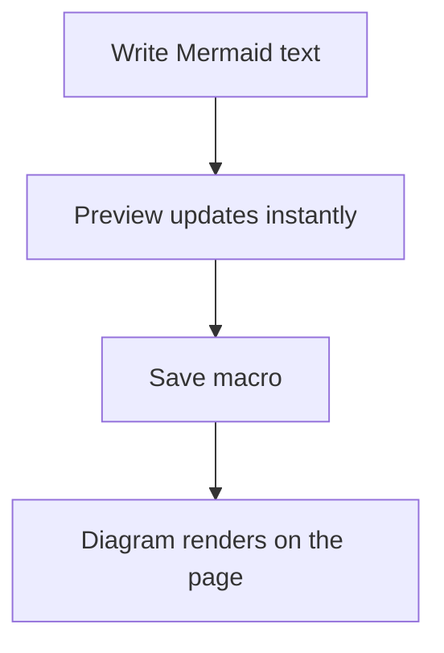

# Mermaid Diagram User Guide

## What This Macro Does

`Mermaid Diagram` lets you write Mermaid syntax inside Confluence and render it as a diagram on the page.

You can use it for:

- flowcharts
- sequence diagrams
- class diagrams
- state diagrams
- ER diagrams
- gantt charts
- pie charts
- and other Mermaid-supported diagram types available in this app

## Insert the Macro

1. Open a Confluence page in edit mode.
2. Insert the `Mermaid Diagram` macro.
3. The configuration window opens automatically.

## Create a Diagram

1. Enter Mermaid text in the editor on the left.
2. Watch the live preview on the right.
3. Select `Save Macro` when the diagram looks correct.
4. Publish or update the Confluence page as usual.

## Example

## Editor Tools

### Draft actions

- `Restore Draft`: loads the locally autosaved draft back into the editor
- `Revert to Saved`: removes the local draft and restores the last saved macro content

### Source actions

- `Insert Example`: inserts a sample Mermaid diagram
- `Trim Empty Lines`: removes empty lines from the start and end of the editor content

### Output actions

- `Copy Source`: copies the Mermaid source text
- `Export SVG`: downloads the rendered diagram as an SVG file

### Macro actions

- `Cancel`: closes the editor without saving new macro content
- `Save Macro`: saves the current Mermaid source into the macro

## Draft Behavior

The editor keeps a local browser draft while you work.

This means:

- unsaved text can still be available if you close the editor
- drafts are stored locally in your browser
- drafts are not the same as saved macro content until you select `Save Macro`

## Preview and Viewing Controls

In the rendered macro view, you can:

- zoom in
- zoom out
- reset to `100%`
- open fullscreen mode
- copy the source from the `Source` section

## If the Diagram Does Not Render

If the Mermaid syntax is invalid, the macro shows an error panel instead of a broken diagram.

Check:

- spelling and Mermaid keywords
- missing arrows or brackets
- diagram type on the first line, such as `flowchart TD` or `sequenceDiagram`

## Tips

- Save often when working on larger diagrams.
- Use `Restore Draft` if you accidentally close the editor before saving.
- Use `Revert to Saved` if you want to discard your unsaved local changes.
- If the preview looks crowded, use zoom controls or fullscreen mode.
